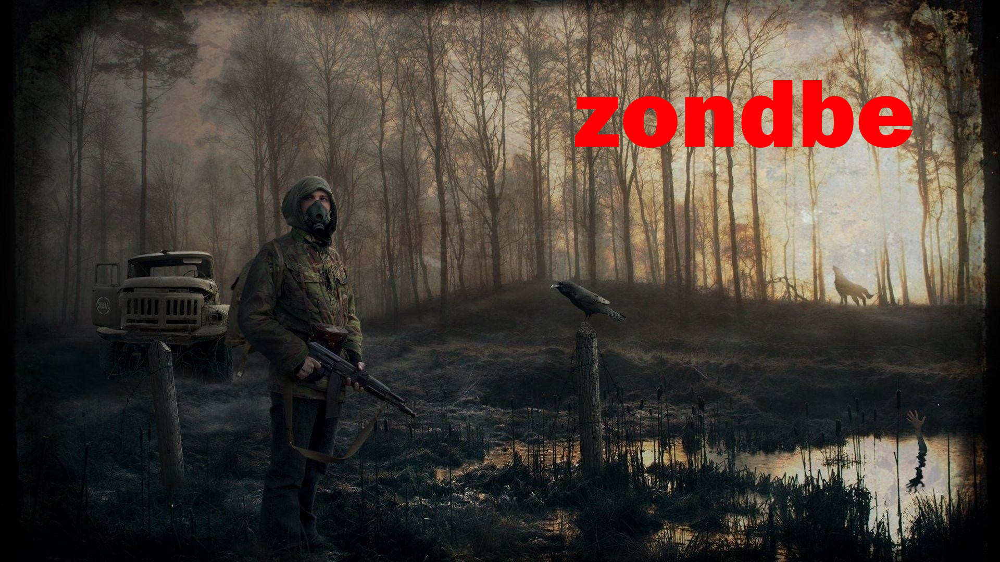
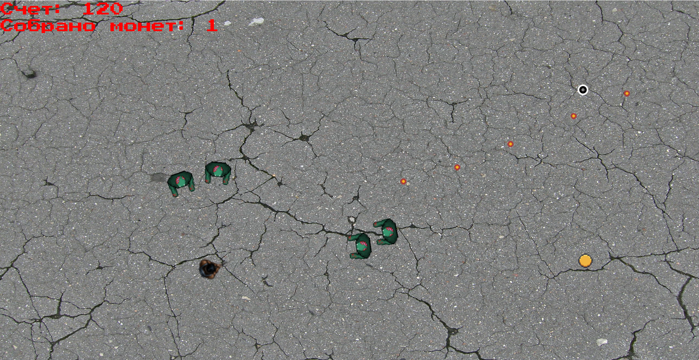

# Zondbe

Zondbe — это динамичный шутер с видом сверху, в котором ваша цель заработать наибольшее количество очков, убивая зомби и собирая монеты.

## Особенности

- **Очки:** За каждую собранную монету вы получаете 20 очков.

## Типы монет

- **Обычная монета:** немного увеличивает скорость главного героя.
- **Монета с боеприпасами:** увеличивает скорость стрельбы на 5 секунд.
- **Красная монета:** замедляет зомби на 5 секунд.

## Уровень сложности

Со временем скорость движения зомби увеличивается, повышая общую сложность игры.

## Управление

- **Передвижение:** W, A, S, D
- **Стрельба:** Левая кнопка мыши

Погрузитесь в мир Zondbe и постарайтесь выжить как можно дольше, набирая максимальное количество очков и одолевая полчища зомби!
